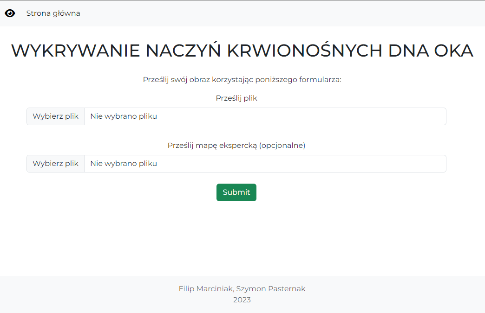
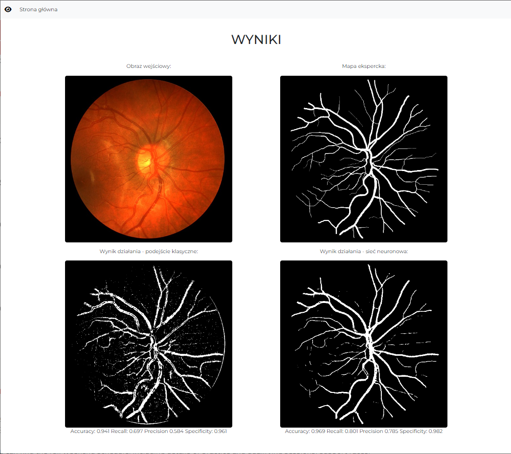

# Retinal blood vessels segmentation

Detection of retinal blood vessels using classical methods (edge detection using filters) and deep neural network methods (UNet).

## Web application

Windows-64

1. Download current UNet release from [Releases](https://github.com/anras5/BloodVessels/releases).
2. Place downloaded `.pth` file in `models` folder. 
3. Execute commands:
```commandline
conda create --name <env> --file .\requirements.txt
conda activate <env>
python main.py
```

Web application allows the user to upload their own images and see the results.





## Jupyter Notebook

All core functionalities of the project are located in the `notebooks` folder.

## Built with

- Python 3.9
- PyTorch
- OpenCV
- Flask

## Contact

filip.marciniak15@gmail.com